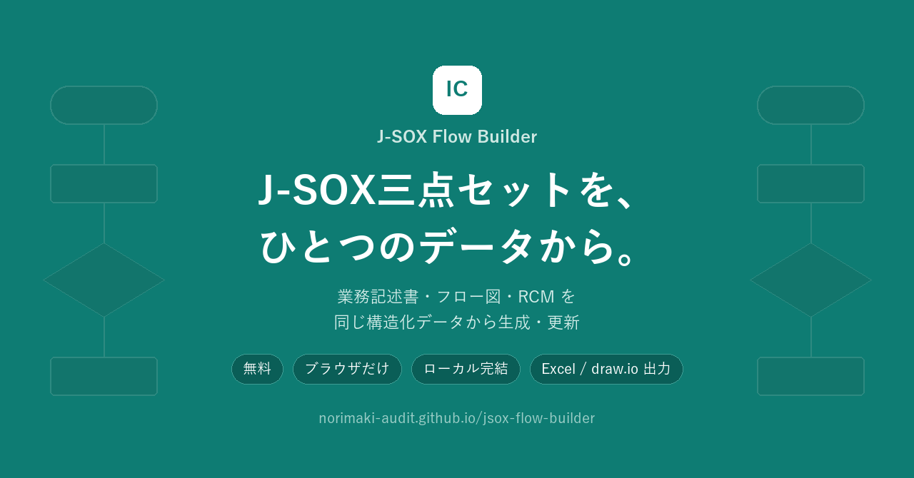
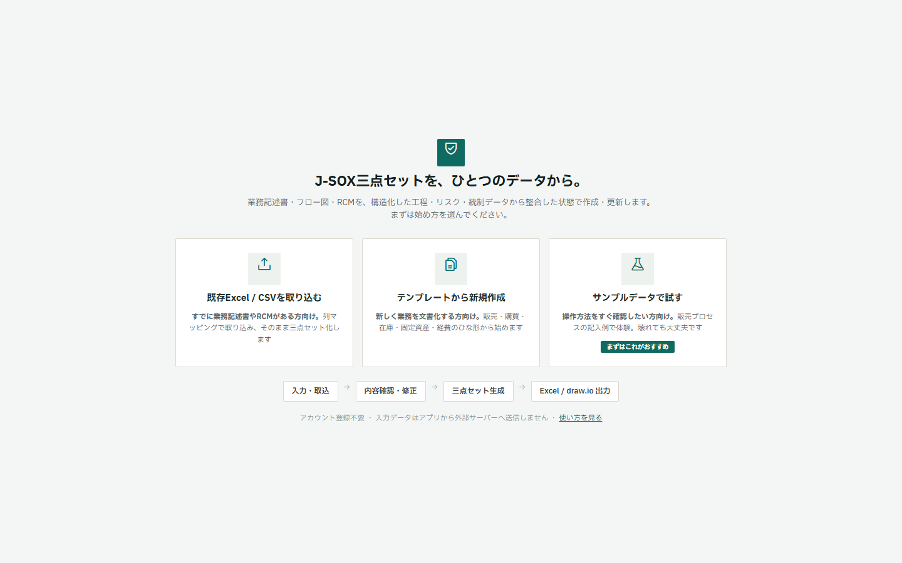
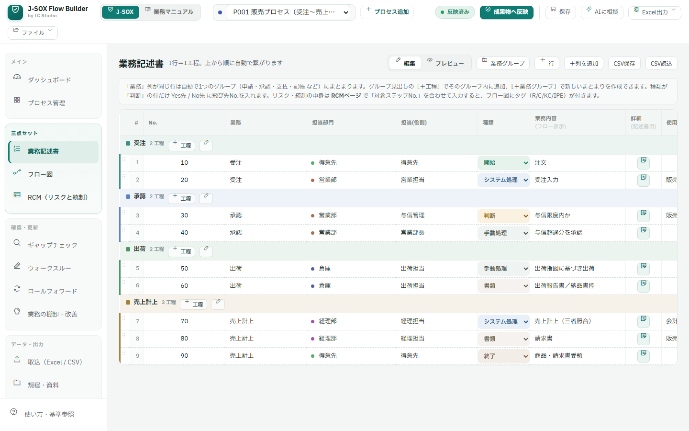
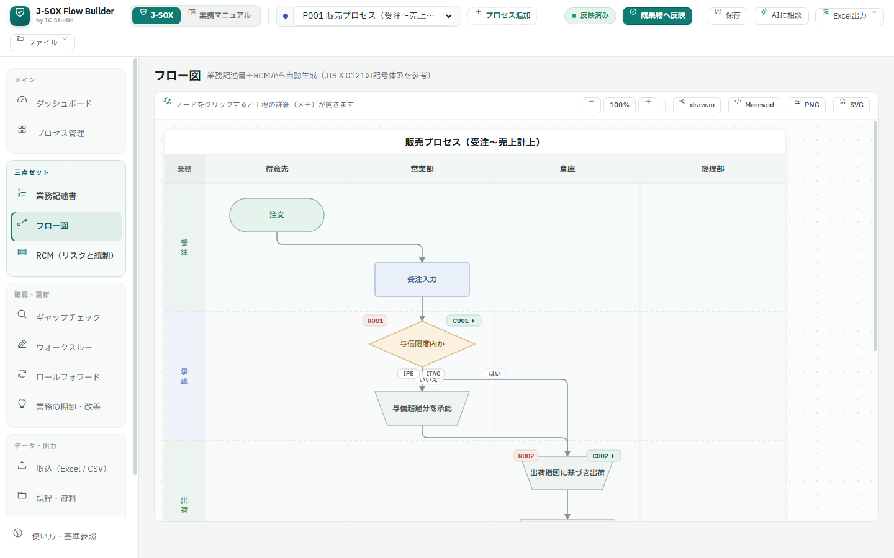
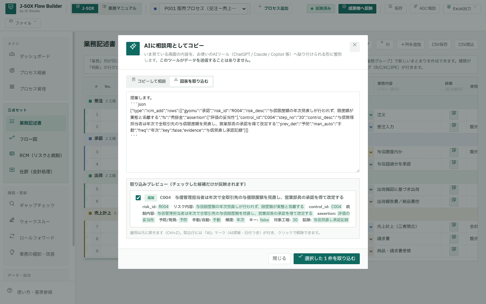

<p align="center"></p>

# J-SOX Flow Builder

[](https://github.com/norimaki-audit/jsox-flow-builder/actions/workflows/ci.yml)

**バラバラのExcelで管理されているJ-SOX三点セットを、一つの構造化データから作成・更新できる無料ツールです。**
AIで作成したRCM案等も取り込み、人間が確認・確定したうえで、業務記述書、フロー図、RCM、Excel、draw.io等へ出力できます。

> 🚀 **紹介ページ（スマホOK）** → https://norimaki-audit.github.io/jsox-flow-builder/
> 💻 **アプリを開く（PC推奨）** → https://norimaki-audit.github.io/jsox-flow-builder/jsox_flow_builder.html

| Status | Version | Tested | Self-test | Last verified |
|---|---|---|---|---|
| **Beta** | v0.9.0-beta | Chrome（Edgeは同系エンジンのため動作見込み） | **23項目**（`?selftest=1` で誰でも実行可） | 2026-08-01 |

- 📦 [出力される成果物サンプル](https://norimaki-audit.github.io/jsox-flow-builder/#outputs)（Excel / PDF / draw.io / SVG / JSON — 実出力）
- 🖥️ [実際の操作画面を見る](https://norimaki-audit.github.io/jsox-flow-builder/#shots)（8画面のスクリーンショット）
- 🎬 [操作の流れを動画で見る](https://norimaki-audit.github.io/jsox-flow-builder/#demo)（実機録画・約30秒）
- 🐛 [不具合報告・要望はこちら](https://github.com/norimaki-audit/jsox-flow-builder/issues/new/choose)
- 📎 添付できる形式: 画像(png/jpg/gif/webp)・PDF・Office(xlsx/docx/pptx等)・csv/txt/zip・msg/eml（安全のためHTML・SVG・実行ファイルは受け付けません）
- ⚠️ 既知の制約: スマホでの編集操作は非対応（閲覧案内を表示）／証憑フォルダ格納は Chrome・Edge のみ／Excelの複雑な結合セルは取込時に列マッピングでの調整が必要
- ⚖️ **License: Source-Available** — Free for internal and professional use / Redistribution and re-hosting require permission（[LICENSE.md](LICENSE.md)）

- 💻 PC推奨（横長の表・フロー図を扱うため）
- 📦 インストール不要・アカウント不要
- 🔒 入力した業務データをアプリから外部送信しない（ローカル処理）
- 📥 既存Excel／CSVからの取込に対応
- 📤 Excel／draw.io／PDF等への出力に対応
- 🤖 AI相談用データの生成・AI回答の構造化取込に対応

## 3つの主要価値

1. **三点セットの一元管理** — 工程・リスク・統制を構造化データとして管理し、業務記述書・フロー図・RCMを**同じ構造化データから生成し、三点セット間の更新漏れや構造上の不整合を抑えます**。修正のたびに3ファイルを直す作業から解放されます
2. **既存Excelからの移行** — 各社様式のExcel/CSVを列マッピングで取込。マッピング設定は保存して再利用できます
3. **AI時代の分業設計** — AIは下書き・レビュー、本ツールは構造・整合・確定・出力、人間は判断と責任。AI回答は差分プレビューを確認してから取り込みます

## 実際の操作画面

| | |
|---|---|
|  |  |
| 開始は3択（取込／テンプレート／サンプル） | 業務記述書：1行＝1工程 |
|  |  |
| フロー図は自動生成（JIS記号・R/Cタグ） | AI回答は差分を確認してから取込 |

→ その他の画面は紹介ページの[操作画面を見る](https://norimaki-audit.github.io/jsox-flow-builder/#shots)

## 基本的な利用フロー

```
入力・取込（Excel/CSV・テンプレート・サンプル）
  ↓
内容確認・修正（工程 ⇄ リスク・統制の関連付け）
  ↓
三点セット生成（業務記述書・フロー図・RCM が同期）
  ↓
Excel／draw.io／PDF等へ出力
```

## AIとの役割分担

| 担当 | 役割 |
|---|---|
| AI | 下書き、文章改善、リスク候補、網羅性確認、壁打ち |
| 本ツール | **構造化、三点セット間の整合、保存、差分確認、成果物出力** |
| 人間 | 内容確認、判断、修正、承認、最終責任 |

AIへの送信は自動では行いません。ツール内で相談用データを生成 → 利用者が任意のAIへ貼り付け → 回答を貼り戻すと**取込内容をプレビュー**し、確定した内容だけが正式データに反映されます（Undo可）。

## PCでの始め方

1. [アプリを開く](https://norimaki-audit.github.io/jsox-flow-builder/jsox_flow_builder.html)（推奨: 最新版の Chrome または Edge。Firefox / Safari では証憑フォルダ格納など一部機能が利用できない場合があります）
2. 開始画面で「サンプルデータで試す」を選択（まずはこれがおすすめ）
3. 慣れたら「既存Excel/CSVを取り込む」または「テンプレートから新規作成」で自社データへ

`jsox_flow_builder.html` をダウンロードしてダブルクリックでも動作します（オフライン時はフォント・アイコンが簡易表示）。

## データ・プライバシー

- 入力した業務データは、アプリから外部サーバーへ**送信しません**（ブラウザ内で処理）
- 画面表示用のフォント・アイコン等はCDNから取得します（入力データとは無関係です）
- 作業内容はブラウザに自動保存（2世代）され、**プロジェクト保存(.json)** でPCに恒久保存・復元できます
- 詳細は [docs/PRIVACY.md](docs/PRIVACY.md)

## 主な出力形式

装飾付きExcel（フロー図込み）／値のみExcel／CSV／draw.io／Mermaid／PNG・SVG／印刷・PDF（監査調書スタイル）

<details>
<summary>評価管理等のオプション機能（初期状態では非表示）</summary>

ファイルメニューの「評価・証憑管理機能」をオンにすると利用できます。オフでもデータは保持されます。

- 整備・運用評価（評価主体・手続種類・査閲欄つき）
- サンプリング調書（1統制1葉・サンプル別結果・例外自動集計）
- 評価結果一覧
- 不備管理
- 証憑管理（ブラウザ内格納／PCフォルダ格納）

また「業務マニュアルモード」に切り替えると、J-SOX評価を使わない手順書＋業務フロー図の作成ツールとして利用できます。

</details>

## 制約・免責

- ベータ版・開発中です。バックアップとして .json 保存をご活用ください
- 本ツールは内部統制文書の作成を支援するものであり、特定の様式・監査対応を保証するものではありません。実際の評価・開示にあたっては、金融庁「財務報告に係る内部統制の評価及び監査の基準」等をご確認ください
- スマートフォンでは概要閲覧を想定しています（操作はPC推奨）

## リポジトリ構成

| パス | 内容 |
|---|---|
| `jsox_flow_builder.html` | アプリ本体（単一HTML・これ1つで動作） |
| `index.html` | 紹介ページ（スマホ対応） |
| `assets/` | スクリーンショット・OG画像 |
| `docs/` | 利用ガイド・プライバシー・開発資料アーカイブ |
| `docs/CHANGELOG.md` | 更新履歴 |
| `licenses/` | 本体・第三者ライセンス関連 |
| `.github/` | 貢献方針・セキュリティポリシー・CI |

## 開発状況

公認会計士が実務経験をもとに、AI（Claude Code）を活用して開発しています。現在も操作性・出力・AI連携を改善中です。ご意見・不具合報告は [Issues](https://github.com/norimaki-audit/jsox-flow-builder/issues) へ。

## ライセンス

本ツールは**無料で利用できます**。個人利用、法人の社内利用（商用の業務を含む）、公認会計士・コンサルタント等の**専門家によるクライアント業務での利用**を含みます。

本プロジェクトはオープンソースソフトウェアではなく、**Source-Available（ソース公開型）** ソフトウェアです（ライセンス: **J-SOX Flow Builder Source-Available License 1.0**）。

- ソースコードの再配布、改変版の公開、再ホスティング、派生サービス・他製品への組込みには**事前の許諾**が必要です（[Issues](https://github.com/norimaki-audit/jsox-flow-builder/issues) でご相談ください）
- 本ツールで作成した**成果物（業務記述書・フロー図・RCM・Excel等）は利用者に帰属**し、自由に利用・配布・納品できます
- 同梱・参照する第三者ライブラリには各ライセンスが適用されます（[licenses/THIRD_PARTY_NOTICES.md](licenses/THIRD_PARTY_NOTICES.md)）

詳細は [LICENSE.md](LICENSE.md) を、貢献の方針は [.github/CONTRIBUTING.md](.github/CONTRIBUTING.md) を、着想元は本ページ末尾の[謝辞](#謝辞着想元)をご覧ください。

## 謝辞（着想元）

本プロジェクトの開発のきっかけの一つは、兎耳山ルカ氏（tomiyamaluca）の次のプロジェクト・記事です。

- リポジトリ: [tomiyamaluca/CC_Internal_Control](https://github.com/tomiyamaluca/CC_Internal_Control)（MIT License）
- 内容: Claude Code を用いて内部統制三点セット（業務記述書・業務フロー図・RCM）を drawio 形式まで一括生成する試み

「AIで三点セットを生成する」という発想から大きな刺激を受けました。この場を借りて感謝します。

**本プロジェクトとの関係**

J-SOX Flow Builder は、生成された後の**編集・保存・Excel取込・整合チェック・評価・証憑・不備管理**までを扱うことを目的に、単一HTMLのWebアプリとして**独自に実装**したものです。

両プロジェクトを比較のうえ確認した結果、CC_Internal_Control のコード、プロンプト（CLAUDE.md）、Markdown/drawioテンプレート、サンプルデータからの**具体的な流用はありません**（本プロジェクトのデータモデル・列構成・サンプルプロセス・drawio出力はいずれも独自実装です）。本プロジェクトは同プロジェクトの派生物ではなく、公式・非公式を問わず関係を示すものでもありません。
