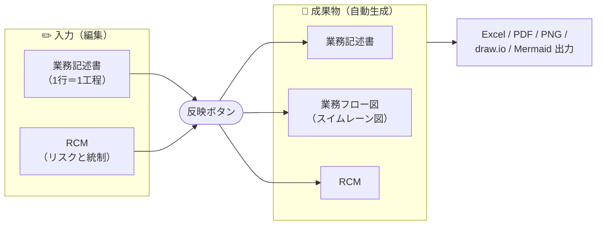
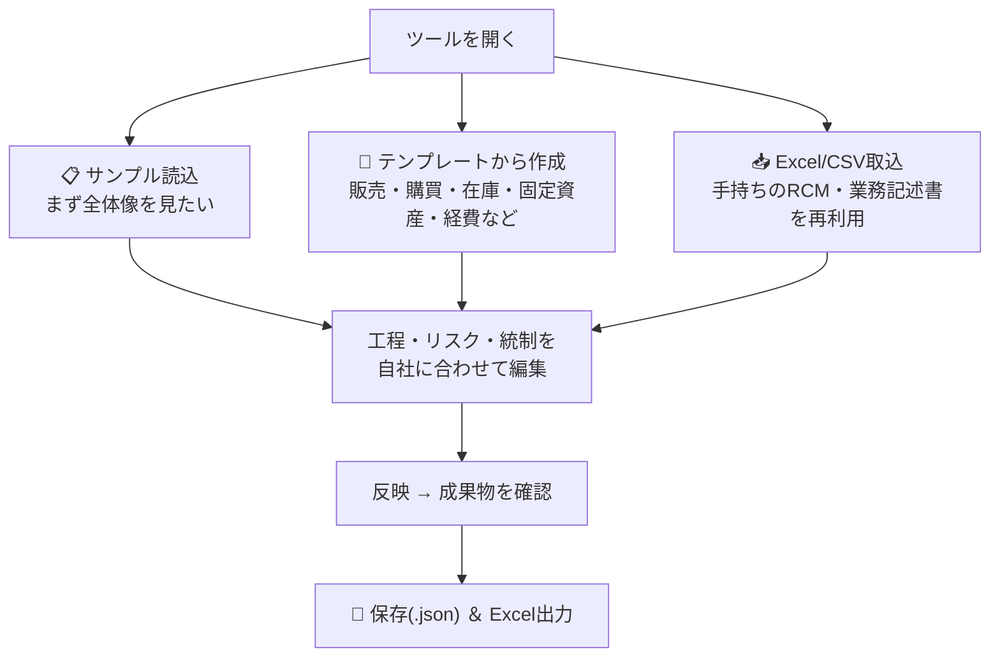

# J-SOX 三点セット作成ツール

**業務記述書・業務フロー図・RCM（リスク・コントロール・マトリクス）── いわゆる「三点セット」を、ブラウザだけで作成できる無料ツールです。**

インストール不要・サーバー不要・データは自分のPCの外に出ません。

> 🚀 **今すぐ試す** → https://norimaki-audit.github.io/jsox-flow-builder/
> （サンプルデータ入りで起動します。壊れても大丈夫なので自由に触ってください）

---

## こんな人のためのツールです

| モード | 対象 | できること |
|---|---|---|
| 🛡 **J-SOX** | 上場企業・IPO準備企業の内部統制担当 | 三点セットの作成 ＋ 整備/運用評価・不備管理・証憑管理・報告書ドラフトまで |
| 📖 **業務マニュアル** | 中小企業・士業・バックオフィス | 手順書と業務フロー図の作成。属人化の解消・引継ぎ・教育に |

モードは画面上部でいつでも切り替えられます（データは共通）。

---

## 基本の流れ

**1か所に入力すれば、三点セットがそろって出来上がる**のがこのツールの考え方です。

- **工程を表に入力するだけで、フロー図は自動で描かれます**（JIS X 0121 準拠の記号）
- RCMで「対象ステップNo.」を指定すると、フロー図の該当工程に **R（リスク）/ C（統制）タグ**が付きます
- 各画面は **編集 ｜ プレビュー** をワンクリックで切り替えられます

## はじめかたは3通り

---

## 主な機能

- **ダッシュボード** — 統制数・評価進捗・アサーション網羅・不備・証憑の状況をひと目で把握
- **ギャップチェック** — 記載漏れや不整合（分岐先がない、証跡未設定 など）を自動検出
- **評価・点検**（J-SOX） — 整備/運用評価の記録、不備管理（3区分）、証憑の格納・依頼管理、ロールフォワード（前期との差分）
- **取込** — 各社様式のExcel/CSVを列マッピングで取込。マッピング表は保存して再利用可能
- **出力** — 装飾付きExcel（フロー図込み）／値のみExcel／CSV／PNG・SVG／draw.io／Mermaid／印刷・PDF

## データの扱い（安心ポイント）

- 🔒 **すべてブラウザ内で完結**します。入力した内容が外部に送信されることはありません
- 💾 作業内容は「プロジェクトを保存(.json)」でPCに保存し、次回「開く」で再開します
- ⚠️ ブラウザを閉じると未保存の内容は消えるため、**作業後は必ず保存**してください

## 動作環境

- 新しめの Chrome / Edge / Firefox / Safari
- `jsox_flow_builder.html` をダウンロードして**ダブルクリックで開くだけ**でも動きます（オフライン可。その場合フォント・アイコンは簡易表示）

---

## リポジトリ構成

| パス | 内容 |
|---|---|
| `jsox_flow_builder.html` | **アプリ本体**（単一HTML・これ1つで動作） |
| `index.html` | GitHub Pages 用の入口（本体へ転送） |
| `J-SOX 三点セット リデザイン.dc.html` / `support.js` | UIデザインのプロトタイプ |
| `実装反映ガイド.md` | UIリデザインの実装仕様書 |
| `design_handoff_jsox_redesign/` | デザインハンドオフ一式 |
|  `screenshots/` | 開発時のスクリーンショット・参照画像 |

## 免責

本ツールは内部統制文書の作成を支援するものであり、監査上の義務や特定の様式を保証するものではありません。実際の評価・開示にあたっては、金融庁「財務報告に係る内部統制の評価及び監査の基準」等をご確認ください。
